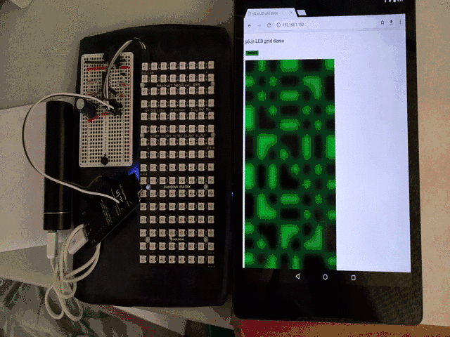

p5.js and WS281x RGB LEDs
=========================



The ESP8266 Arduino framework supports WS281x RGB LEDs (also known as Adafruit
NeoPixels), HTTP server, and Web Sockets server. Add in p5.js and now p5.js can
drive RGB LEDs. The ArduinoWebsocket library supports HTML5 web sockets so
node.js and socket.io are not used.

```
8x16 WS281x LEDs <- ESP8266 <-> WiFi Router <-> HTML5 Web browser
```

The LED grid is composed of 2 8x8 grids with a total of 128 WS281x LEDs.

The ESP8266 is a NodeMCU devkit 1.0 from Lolin but many similar boards based
on the ESP8266 can be used.

HTML5 Web browser can be one of Safari, Chrome, Firefox, etc. Pre-HTML5
browsers without web sockets are not supported. Don't worry, all commonly
available browsers support web sockets.

The WiFi router with a connection to the Internet is required so the browser
can download p5.min.js from a CDN (Content Distribution Network). It might be
possible to squeeze p5.min.js into the ESP8266 SPIFFS file system but this has
not been explored.

The ESP8266 Arduino sketch communicates with the p5.js sketch over an HTML5 web
socket. The p5.js sketch sends LED RGB values to the ESP8266. The ESP8266
pushes the RGB values to the WS281x LED grid via the NeoPixelBus library.
NeoPixelBus is designed to avoid disabling interrupts so the ESP8266 can
receive data over WiFi while updating the LEDs.

## p510print


p510print divides the LED grid into 2x2 subgrids. Each subgrid contains either
a forward slash or a backward slash.

```C
  if (random(1) < 0.5) {
    // * -
    // - *
    ledgrid.set(col, row, GREEN);
    ledgrid.set(col+1, row+1, GREEN);
  }
  else {
    // - *
    // * -
    ledgrid.set(col, row+1, GREEN);
    ledgrid.set(col+1, row, GREEN);
  }
```

When the grid is full, the grid is erased and the process starts over. The
frame rate is set to 10 frames per second.

## p5jsws281x


p5jsws281x displays a circle 5 LEDs in diameter. The circle follows the pointer
(mouse cursor or finger). The color changes randomly on mouse click and screen
touches.

## Future (maybe)

The LEDs are modelled in a canvas created using createGraphics sized based on 1
pixel per LED. For display, the LED canvas is stretched to fit the display
canvas. This process blurs the image which is nice but not expected.  Another
option is to update the display canvas then shrink it to fit the LED grid. This
might produce different effects.

The LED grid is very low resolution so 3D graphics will not look 3D. But 3D
might produce interesting effects.

